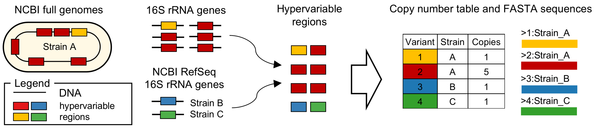

# HiMAP database

These notes describe how to construct a HiMAP database from scratch. It follows the process from the manuscript:




First, clone the repository:
```sh
git clone https://github.com/taolonglab/himapdb.git
cd himapdb
```

To run these scripts you need:
* HiMAP installed: https://github.com/taolonglab/himap
* Python 3, with modules Biopython and Pandas installed


## Metadata

Download the NCBI Genome database metadata for Bacterial and Archaeal genome assemblies and select only the best assembly for each unique strain:
```sh
python3 py/dl_genome_meta.py data/

```

This will first download two files:
* `data/archaea_assembly_summary_2018-05-20.txt`
* `data/bacteria_assembly_summary_2018-05-20.txt`

then generate a filtered assembly summary with unique strain names:
* `data/archaea_assembly_summary_filter_2018-05-20.txt`
* `data/bacteria_assembly_summary_filter_2018-05-20.txt`

and files with direct links to download FASTA sequences and GFF annotations:
* `data/archaea_assembly_features_urls.txt`
* `data/archaea_assembly_features_urls.txt`
* `data/bacteria_assembly_features_urls.txt`
* `data/bacteria_assembly_features_urls.txt`

Note: if you want to download only specific kingdom(s) these can be given as a second argument, i.e.
```sh
python3 py/dl_genome_meta.py data/ archaea
```

or both (same as omitting it):

```sh
python3 py/dl_genome_meta.py data/ archaea,bacteria
```

## Download data

Now, download the sequences. This will be a large download and may take a day or so to complete.
```sh
mkdir data/sequences
mkdir data/features

cd data/features
python3 ../../py/download.py ../archaea_assembly_features_urls.txt 10
python3 ../../py/download.py ../bacteria_assembly_features_urls.txt 10

cd ../sequences
python3 ../../py/download.py ../archaea_assembly_sequences_urls.txt 10
python3 ../../py/download.py ../bacteria_assembly_sequences_urls.txt 10
```

where the second argument specifies the number of concurrent download connections to speed up the download. Increasing number of connections can speed up the download significantly but also lead to some failed downloads (files with size 0). These can be re-downloaded, by deleting them and re-running the script with 1 concurrent download option. The download script will skip re-downloading any existing files.

For example to re-download missing sequences, run this from the `sequences` folder:

```sh
for f in $(find . -size 0); do rm $f; done
python3 ../../py/download.py ../archaea_assembly_sequences_urls.txt 1
```

while some downloads will always result in 0 size files (next script will just skip those).


## Extract 16S sequences from full genomes

Extract 16S ribosomal RNA gene sequences from FASTA sequences, based on their GFF annotations. No need to uncompress anything. Switch back to the `himapdb` folder and run `extract.py`. This script takes 3 inputs: (i) filtered assembly summary file, (ii) folder with downloaded GFF features and (iii) folder with downloaded sequences. The last argument is the output FASTA file:

```sh
cd ../../

python3 py/extract.py \
    data/archaea_assembly_summary_filter_2018-05-20.txt \
    data/features/ data/sequences/ \
    data/16s_from_genomes_archaea_2018-05-20.fasta

python3 py/extract.py \
    data/bacteria_assembly_summary_filter_2018-05-20.txt \
    data/features/ data/sequences/ \
    data/16s_from_genomes_bacteria_2018-05-20.fasta

```


## Generate files for each primer set

```sh

python3 py/primers_fasta.py \
    primers/nucleotide_codes.txt \
    primers/pcr_primers_table.txt \
    data/pcr_primers    
```

The `data/pcr_primers` folder now contains FASTA files for each primer set:
* V1-V8_8F-1392R.fasta
* V3-V4-2_341F-805R.fasta
* V3-V4-V5-V8_337F-1392R.fasta
* V3-V4-V5_337F-926R.fasta
* V3-V4_337F-805R.fasta
* V4_515F-805R.fasta


## Count hypervariable variants

Align primers vs 16S sequences from full genome:

```sh
python3 py/count.py \
    data/16s_from_genomes_archaea_2018-05-20.fasta \
    data/16s_from_genomes_bacteria_2018-05-20.fasta \
    data/archaea_assembly_summary_filter_2018-05-20.txt \
    data/bacteria_assembly_summary_filter_2018-05-20.txt \
    data/pcr_primers/ \
    data/ 22 
```

8th argument can be added with a text pattern if we just want to regenerate files for a specific primer set, e.g.
```sh
python3 py/count.py \
    data/16s_from_genomes_archaea_2018-05-20.fasta \
    data/16s_from_genomes_bacteria_2018-05-20.fasta \
    data/archaea_assembly_summary_filter_2018-05-20.txt \
    data/bacteria_assembly_summary_filter_2018-05-20.txt \
    data/pcr_primers/ \
    data/ 22 200 V4_515F-805R

python3 py/count.py \
    data/16s_from_genomes_archaea_2018-05-20.fasta \
    data/16s_from_genomes_bacteria_2018-05-20.fasta \
    data/archaea_assembly_summary_filter_2018-05-20.txt \
    data/bacteria_assembly_summary_filter_2018-05-20.txt \
    data/pcr_primers/ \
    data/ 22 400 V3-V4_337F-805R
```

where we also specified the minimum length for sequences between primers, for each primer pair (200 nt for V4 and 400 nt for V3-V4).

For each primer set, this will produce:
* `data/pcr_primers/V3-V4_337F-805R_primers_miss.txt` file which contains assembly IDs that didn't have hit to either forward or reverse (or both) primer in the pair
* `data/pcr_primers/V3-V4_337F-805R_blast.txt` table with BLAST results
* `data/16s_from_genomes_2018-05-20_V3-V4_337F-805R_hang22_counts.txt` file which is a table with counts for each hypervariable region
* `data/V3-V4_337F-805R_hang22_sequences.fasta` which is a FASTA file with hypervariable region sequences

From this point on we will process only V3-V4 primers, but the same can be done for V4 by replacing V3-V4_337F-805R with V4_515F-805R everywhere.

## Download NCBI RefSeq 16S rRNA gene sequences

Now, we want to merge these genome assembly sequences with strains that do not have full genome information. We first query NCBI RefSeq database for 16S sequences (in 10K chunks) and download them to a FASTA file `data/16S_RefSeq_2018-05-20.fasta`:

```sh
python3 py/dl_refseq.py data/16s_RefSeq_2018-05-20.fasta
```


## Add RefSeq hypervariable variant sequences

We go through each strain name from the NCBI RefSeq search results and add sequences if the strain name is not an exact match to something already in the database. Do this for each primer set separately. The arguments to `add_refseq.py` are:

1. 16S RefSeq FASTA from previous step
2. 16S genome assembly hypervariable sequences table from `count.py`
3. 16S genome assembly hypervariable sequences FASTA from `count.py`
4. PCR primers in FASTA file (from `primers_fasta.py`)
5. Output combined table
6. Output combined FASTA
7. Overhang for PCR primer alignment (use the same as for NCBI Genome in the previous step)

```sh
python3 py/add_refseq.py \
    data/16s_RefSeq_2018-05-20.fasta \
    data/16s_from_genomes_2018-05-20_V3-V4_337F-805R_hang22_counts.txt \
    data/V3-V4_337F-805R_hang22_sequences.fasta \
    data/pcr_primers/V3-V4_337F-805R.fasta \
    data/V3-V4_337F-805R_hang22_wrefseq_table.txt \
    data/V3-V4_337F-805R_hang22_wrefseq_sequences.fasta \
    22
```

This will add any missing strains to both the FASTA file and the count table (RefSeq sequences will have copy number set to 1).

## Remove taxonomic outliers

Sometimes, there will be one or very few strains with sequence (e.g. _Bacillus cereus_ BC04) that is identical to strains from completely different phylum (e.g. Escherichia coli). These look like errors either in assembly or taxonomic assignment and usually contribute <= 1% to that phylum. In this example _B. cereus_ BC04 is the only strain from Firmicutes phylum that has an exact same sequence as thousands of strains from Proteobacteria phylum: _Escherichia_, _Shigella_ etc. We repeated this process for Phylum, Class, Order and Family ranks.

Let's also put the final files in the new `database` folder. The contents of this folder can be copied directly into the HiMAP database folder (we will explain shortly how to find it).

```sh
mkdir database

Rscript --vanilla R/remove_taxonomic_outliers.R \
    data/V3-V4_337F-805R_hang22_wrefseq_table.txt \
    database/V3-V4_337F-805R_hang22_wrefseq_table_R.txt \
    data/V3-V4_337F-805R_excluded_outlier_strains.txt
```

The removed strains are saved in `data/V3-V4_337F-805R_excluded_outlier_strains.txt`


## Generate BLAST database

```sh
python3 py/makeblastdb.py \
    data/V3-V4_337F-805R_hang22_wrefseq_sequences.fasta \
    database/V3-V4_337F-805R_hang22_wrefseq_sequences_unique_variants

```


## Copy files to HiMAP package folder

The location of HiMAP installation can be found in the command line:
```sh
Rscript --vanilla -e "cat(find.package('himap'), fill=T)"
```

the output on macOS is typically along the lines of `/Library/Frameworks/R.framework/Versions/3.4/Resources/library/himap`. Then we can just copy the files:

```sh
cp database/*.* /Library/Frameworks/R.framework/Versions/3.4/Resources/library/himap/database
```

